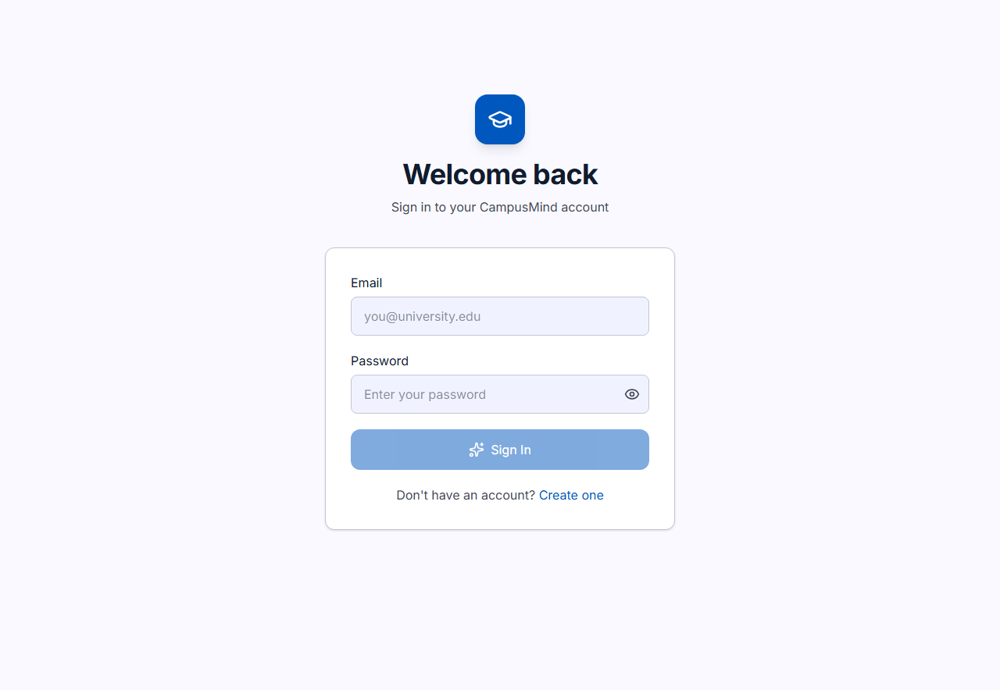
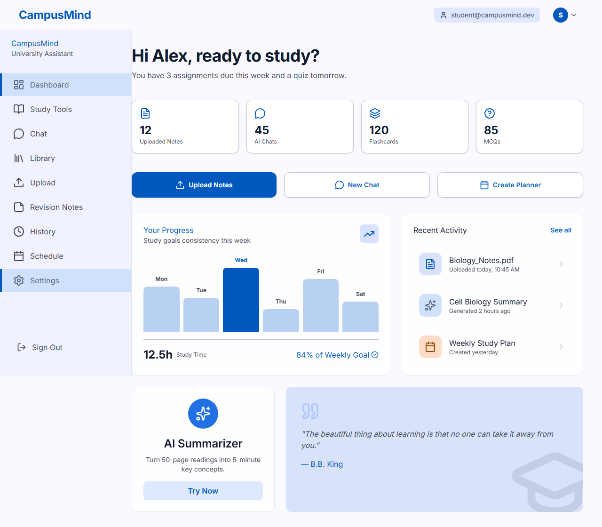
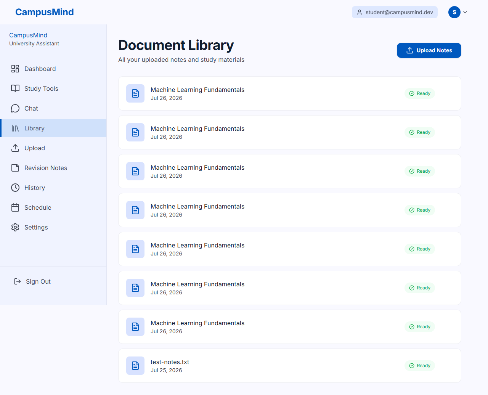
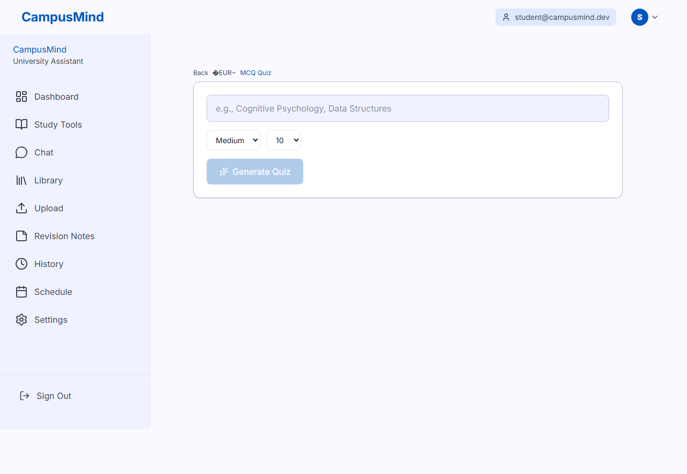
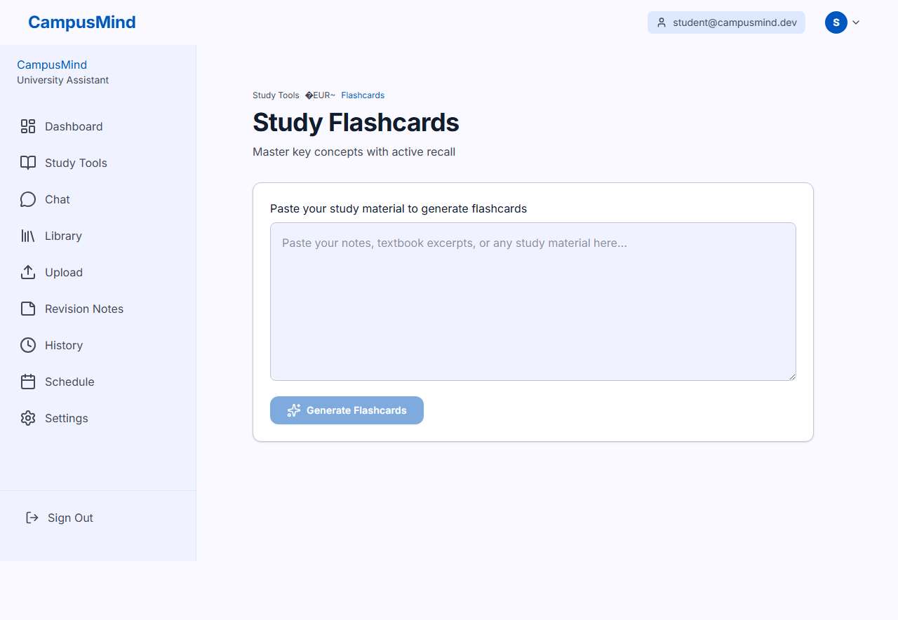
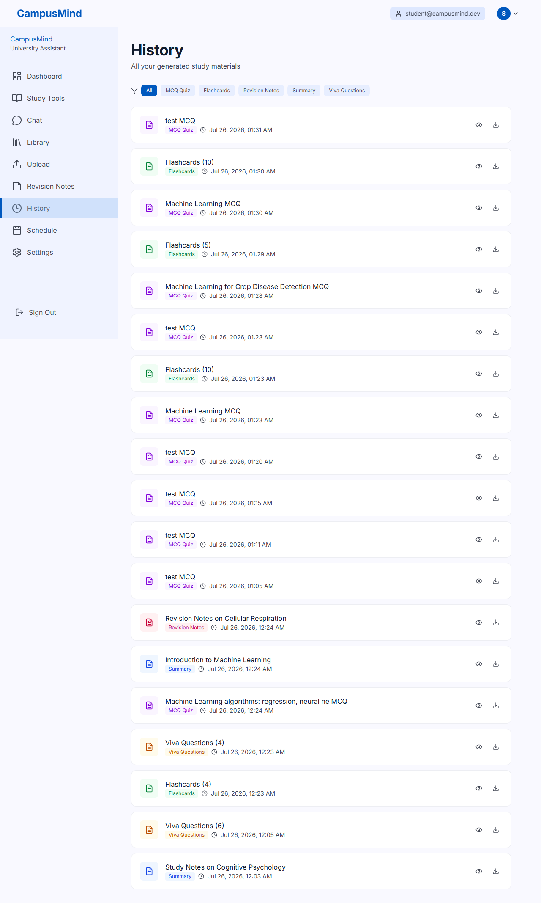
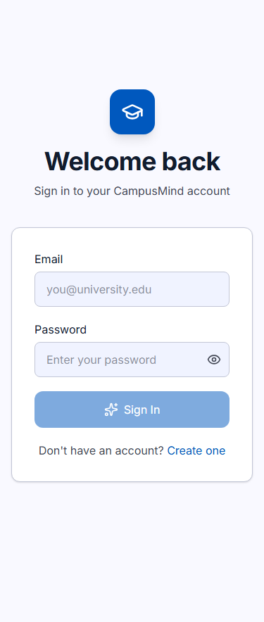

# CampusMind — Your Personal University Learning Assistant

> **Live URL:** [https://frontend-phi-tan-43.vercel.app](https://frontend-phi-tan-43.vercel.app)
> **Backend API:** [https://backend-khaki-delta-33.vercel.app](https://backend-khaki-delta-33.vercel.app)

AI-powered study assistant for university students. Upload your notes (PDF, DOCX, images), get AI-generated summaries, MCQs, flashcards, viva questions, revision notes, and a personalized study plan — all powered by OpenRouter (GPT-4o-mini) and Supabase.

---

## Problem

University students drown in course material — hundreds of pages of notes, textbooks, and lecture slides per subject. Manually creating summaries, practice questions, and revision plans is time-consuming and inefficient. Existing tools are either too generic (no document grounding) or too expensive.

## Solution

CampusMind lets students upload any document, then instantly generates:

- **Summaries** with key takeaways and definitions
- **MCQ quizzes** with interactive scoring and end-of-quiz review
- **Flashcard decks** with spaced-repetition tracking (Know It / Still Learning)
- **Viva questions** grouped by difficulty with revealable answers
- **Revision notes** with key concepts, exam tips, and common mistakes
- **Study plans** — day-by-day schedules leading up to an exam date

All artifacts are saved to history for later review and download.

---

## Features

| Feature | Description |
|---|---|
| Document upload | PDF, DOCX, TXT, images — text extracted automatically |
| AI Summary | Short/long summaries with takeaways + definitions |
| MCQ Quiz | Interactive quiz with scoring, check/next, end-of-quiz missed-question review |
| Flashcards | Flip-card UI with Know It / Still Learning tracking + re-queue |
| Viva Questions | Questions grouped by Beginner/Intermediate/Advanced with reveal |
| Revision Notes | AI-generated key concepts, exam tips, common mistakes |
| Study Planner | Day-by-day plan from today to exam date |
| History & Downloads | All artifacts filterable by type, downloadable as JSON |
| Chat with Document | conversational Q&A grounded in uploaded document content |
| Mobile responsive | Touch-optimized UI, works on phone screens |

## Screenshots

| | | |
|---|---|---|
|  |  |  |
| Login page | Dashboard with stats | Document library |
|  |  |  |
| MCQ quiz page | Flashcards page | Artifact history |
|  |
| Mobile viewport (375×812) |

---

## How It Was Built

This project was built with the assistance of an AI coding agent ([opencode](https://opencode.ai)) following structured specification documents (`PRD.md`, `Architecture.md`, `Rules.md`, `phases.md`, `design.md`). The agent executed the build in 10 phases, each with exit criteria verified before proceeding.

### Tech Stack

| Layer | Technology |
|---|---|
| Frontend | [Vite](https://vitejs.dev) + [React 19](https://react.dev) + [Tailwind CSS 4](https://tailwindcss.com) |
| Backend | [Express.js](https://expressjs.com) (Node.js) |
| Database | [Supabase](https://supabase.com) Postgres (Auth, Storage, RLS) |
| AI | [OpenRouter](https://openrouter.ai) — GPT-4o-mini |
| Testing | [Playwright](https://playwright.dev) (30-test E2E suite) |
| Deployment | [Vercel](https://vercel.com) (frontend + backend serverless) |

### Project Structure

```
├── frontend/          Vite + React SPA (14 route pages)
│   ├── src/
│   │   ├── pages/     All route page components
│   │   ├── components/ Shared UI components
│   │   ├── services/   API client with auth handling
│   │   └── utils/     File extractors (PDF/DOCX/TXT)
│   └── public/        Static assets
├── backend/           Express API server
│   ├── src/
│   │   ├── controllers/ Route handlers (auth, documents, mcq, flashcards, etc.)
│   │   ├── services/    AI (OpenRouter), Supabase, artifact persistence
│   │   ├── middleware/  Auth, rate limiting, error handling
│   │   ├── prompts/     AI prompt templates
│   │   ├── schemas/     Zod validation schemas
│   │   ├── routes/      Express route definitions
│   │   └── utils/      Logger, ApiError class
│   └── db/             SQL migration
├── screenshots/       App screenshots
├── playwright-e2e.mjs 30-test E2E suite
└── memory.md          Project state tracker (living document)
```

---

## Install & Run Locally

```bash
# 1. Clone
git clone https://github.com/Engr-Mujeeb-Rahman/CampusMind.git
cd CampusMind

# 2. Backend setup
cd backend
cp .env.example .env   # Fill in your env vars (see below)
npm install
npm start              # Runs on http://localhost:4000

# 3. Frontend setup (new terminal)
cd frontend
cp .env.example ../.env.example   # or create frontend/.env
echo "VITE_API_BASE_URL=http://localhost:4000/api" > .env
npm install
npm run dev            # Runs on http://localhost:5173
```

### Required Environment Variables

**`backend/.env`**
| Variable | Description |
|---|---|
| `SUPABASE_URL` | Supabase project URL |
| `SUPABASE_ANON_KEY` | Supabase anonymous public key |
| `SUPABASE_SERVICE_ROLE_KEY` | Supabase service role key (for admin ops) |
| `OPENROUTER_API_KEY` | OpenRouter API key |
| `OPENROUTER_MODEL` | Model name (default: `openai/gpt-4o-mini`) |
| `CORS_ORIGIN` | Frontend URL (default: `http://localhost:5173`) |

**`frontend/.env`**
| Variable | Description |
|---|---|
| `VITE_API_BASE_URL` | Backend API URL (default: `http://localhost:4000/api`) |

> **Security:** `.env` files are gitignored. Never commit secrets to the repo.

---

## Testing

```bash
# Install Playwright browsers
npx playwright install chromium

# Run E2E suite (servers must be running on localhost:5173 and :4000)
node playwright-e2e.mjs
```

The suite runs 30 tests covering: authentication, document upload, 13 page renders, MCQ/flashcard generation, history/download, mobile viewport, and edge cases.

---

## Future Work

- **Rate-limit handling:** OpenRouter free tier throttles at ~20 requests/minute. Add client-side queuing, exponential backoff on 429 responses, and a clearer "AI is busy" indicator.
- **Subject folders/document organization:** Currently flat document list.
- **Dark mode:** Specified in `design.md` but not yet implemented.
- **Study Planner → Calendar export:** "Add to Calendar" and "Download PDF" buttons are UI-only.
- **Large document chunking:** PDFs over 100 pages may hit context limits.
- **Dashboard personalization:** Welcome banner, stats, and recent activity use hardcoded demo data.

---

## License

MIT — see `LICENSE` for details.
